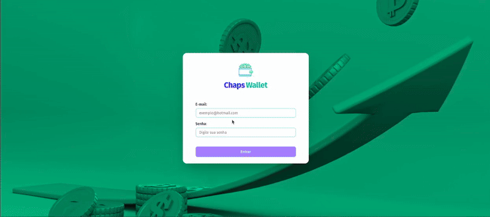

# 💸 ChapsWallet – React + TypeScript + Zustand + Tailwind + Shadcn/UI

Este projeto é uma aplicação **ChapsWallet** desenvolvida com **React**, **TypeScript**, **Zustand** **Tailwind CSS**, **Shadcn/UI** e **Zod**, criada para praticar conceitos de **validação de formulários**, **componentização**, **estilização responsiva** e além de **consumo de API de câmbio** em tempo real..


---
🌐 [Preview do Projeto](https://chaps-wallet.vercel.app/)


## 💻 Preview Desktop



---

## 🚀 Tecnologias Utilizadas

- **React + Vite** — Estrutura do projeto, componentização e reatividade.
- **TypeScript** — Tipagem estática e segurança no desenvolvimento.
- **Tailwind CSS** — Estilização utilitária, responsiva e produtiva.
- **Zustand** — Gerenciamento de estado global simples e performático (com persist)
- **Shadcn/UI** — Componentes acessíveis e customizáveis.
- **Zod + React Hook Form** — Validação de formulários e UX consistente.
- **Lucide Icons** — Ícones leves e escaláveis.

---

## Estrutura do Projeto

```plaintext
chaps-wallet/
├─ src/
│  ├─ assets/
│  │  └─ logo.svg
│  ├─ components/
│  │  ├─ layout/
│  │  │  └─ Header.tsx
│  │  └─ ui/            (componentes do Shadcn)
│  ├─ pages/
│  │  ├─ Login.tsx
│  │  └─ Wallet.tsx
│  ├─ stores/
│  │  ├─ AuthStore.ts
│  │  └─ WalletStore.ts
│  ├─ routes/
│  │  └─ index.tsx
│  ├─ styles/
│  │  └─ global.css
│  ├─ App.tsx
│  └─ main.tsx
└─ package.json
``` 

---

## ⚙️ Funcionalidades

- [x] **Login com validação** usando Zod + React Hook Form
- [x] **Listagem de despesas** com conversão automática para BRL
- [x] **Adição de despesas** (valor, descrição, moeda, método, categoria)
- [x] **Exclusão de despesas** com atualização imediata do total
- [x] **Cálculo do total** convertido (via ask) exibido no Header
- [x] **Requisição de moedas** via API https://economia.awesomeapi.com.br/json/all
- [x] **Persistência** do estado com zustand/persist
- [x] **Responsivo** — Layout adaptável para desktop e mobile

---

## 🎨 Estilização

O projeto utiliza **Tailwind CSS** e **Shadcn/UI** com foco em::

- **Paleta moderna** (verde principal e roxos/azuis de apoio)
- **Cards** com sombras suaves e espaçamentos consistentes
- **Feedback visual** (erros em vermelho, animação leve no campo inválido)
- **Acessibilidade** nos componentes interativos (focus/hover ativos)

---

## 🧩 Componentes Principais

- **Header** — Exibe o e-mail do usuário logado e o total de despesas (BRL).
- **Login** — Formulário validado com Zod (e-mail/senha) e navegação para a Wallet.
- **Wallet** — Formulário de despesas + tabela com conversão e ações.
- **Tabela de Despesas** — Mostra descrição, moeda, câmbio utilizado, valor convertido e ações.

---

## 🧠 Estado Global – `Zustand`

Gerencia toda a lógica principal::

- `fetchCurrencies` → Carrega moedas a partir da API.
- `addExpense` → Adiciona a despesa e guarda o exchangeRates do momento.
- `deleteExpense` → Remove uma despesa pelo id.
- `getTotalExpenses` → Recalcula o total somando value * ask para cada item.

---

## 📥 Clone o repositório

```bash
git clone https://github.com/chapetta/chaps-wallet.git
```


📂 Acesse a pasta do projeto

```bash
cd chaps-wallet
```
⚙️ Instale as dependências

```bash
npm install
```
# ou
```
yarn install
```


▶️ Rode o projeto

``` bash
npm run dev
``` 
# ou
```
yarn dev
``` 


🎯 Objetivo do Projeto

Este projeto foi criado com foco em aprendizado prático de:

    React com TypeScript
    Gerenciamento de estado global com Zustand
    Validação de formulários com Zod + RHF
    Estilização moderna com Tailwind CSS e Shadcn/UI
    Consumo de API e manipulação de dados (cotações em tempo real)e

📜 Licença

Este projeto é de uso livre para fins de estudo. Sinta-se à vontade para contribuir ou sugerir melhorias!
📬 Contato


    
## 📫 Contato


- Email: **cha.petta@hotmail.com**
- LinkedIn: **https://www.linkedin.com/in/yan-chapetta**
